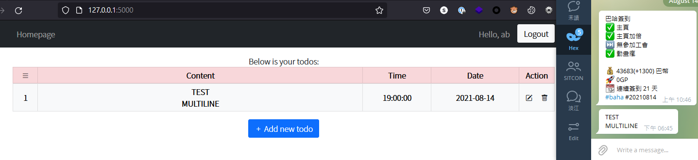

# ToDo Page

## setup

- copy `.env.example` to `.env` and fill in needed values

```shell
cp .env.example .env
```

in `TELEGRAM_TOKEN` field, you should fill in bot token obtained from Telegram bot father.

- install requirements from `requirements.txt`

```shell
pip install -r requirements.txt
```

- run flask server

```shell
flask run
```

## tests

- unittest

```shell
python -m unittest discover
python -m unittest
```

or simply `flask test`

## pics

- successfully received notify from Telegram
   